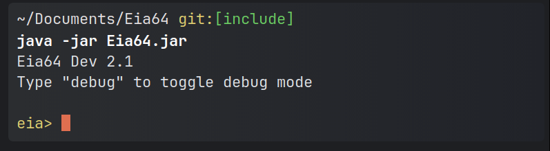

# Eia64


<a href="https://asciinema.org/a/zIBiB6Zh36CEppeWcOsKALxNn" target="_blank"></a>

Eia64 is an interpreted language that draws inspiration from the lovely syntax of Kotlin and many other languages like Go.

## Main highlights

- Standard library
- Importing external classes
- Class structure for object support
- Emphasis on strict typing
- Mutable / Immutable variables
- Functions and overloading
- Access modifiers
- Anonymous Lambdas
- Decent support for tracing errors along with try-catch
- Live trace ability — see how your code flows while it runs

<hr>

## Quick start

- Requires minimum Java version 11

```bash
git clone https://github.com/XomaDev/Eia64
cd Eia64 && java -jar Eia64.jar
```

and tada! You have a fully interactive shell



## You lazy?

If you are afraid of Git, you can try out our SSH version! 👀

```bash
ssh -p 2121 hackclub.app
```

and look what you got! You can try out Eia without installing it. 😎


It's hosted on [Nest](https://github.com/hackclub/nest) by HackClub <b><3</b>

<hr>

## Links

- Eia SSH server: [XomaDev/EiaAPI](https://github/XomaDev/EiaAPI)
- Eia docs: [XomaDev/Eia-Docs](https://github/XomaDev/eia-docs)

<hr>

## Credits

Thanks to [HackClub](https://hackclub.com/) and the community!
Especially the lang-jam event and the Arcade. <b><3</b> \
It filled me with enthusiasm and encouragement for more than 2 years.

<hr>

Enjoy!\
Crafted with Love  ❤️\
Kumaraswamy B G • 16-year-old