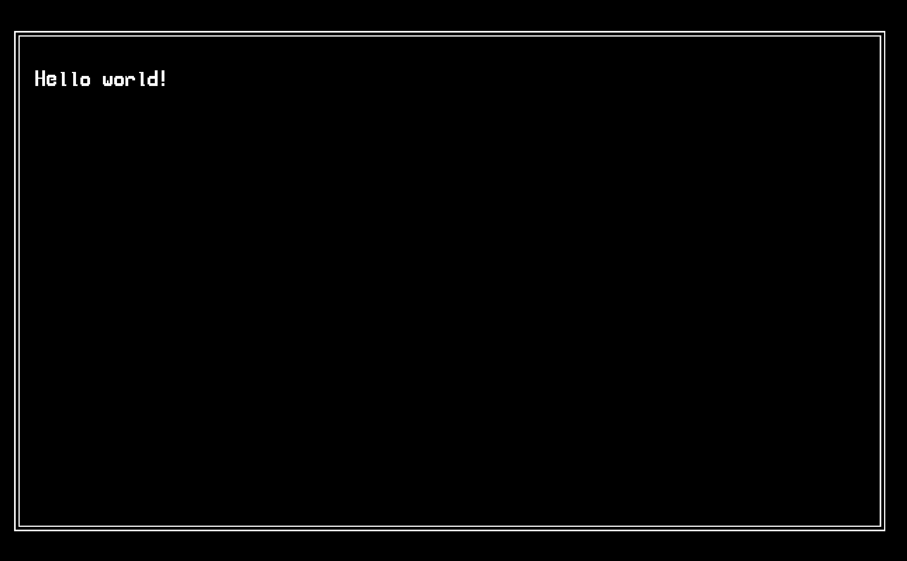
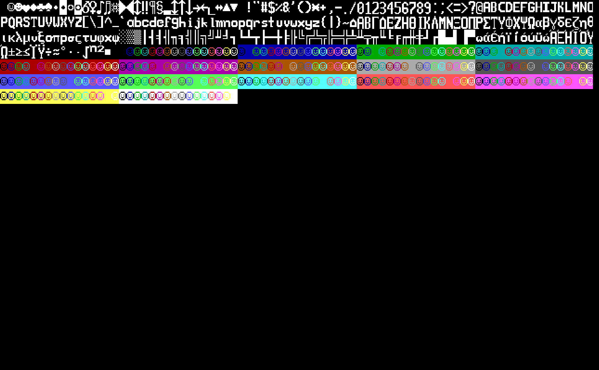

# Examples

This directory contains various examples to demonstrate the functionality of the emulator:

## Box

`box.asm` showcases many of the features of the language and emulator,
including multiplication, conditional jumps, drawing to the screen, etc.

This example draws a border with Unicode box-drawing characters along with a simple hello world:

## Fib

`fib.asm` is a fibonacci sequence calculator that calculates the nth fibonacci number, where n=`COUNT`.
The result is stored in the `D` register.

This example also showcases the `test` functionality of the emulator,
which will check that the final values of the registers match the expected values.

## Mult

`mult.asm` showcases multiplication through the [`math`](https://github.com/commonkestrel/fateful_math  ) library.
This example calls the `mul16` "function" with the arguments `5` and `120`,
storing the high and low bytes of the result in the `H` and `L` registers respectively.

## Screen

`screen.asm` is a relatively small program meant to show off the screen-drawing capabilities.
This program loops through every character in the character set and prints them to the screen.

This can be useful to see what looks nice together and get a feel for the character set of the emulator:

